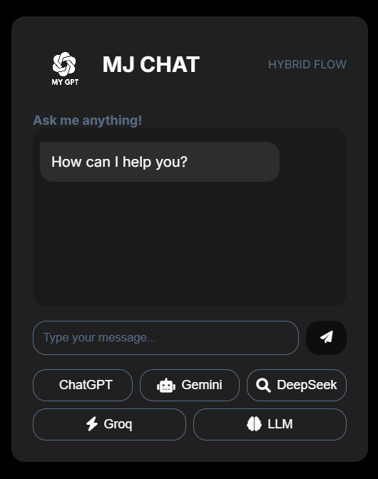

# AI Chatbot (Hybrid)




## Overview

This project involves the development of an advanced hybrid AI chatbot that integrates multiple AI models to enhance interaction capabilities. The chatbot provides users with the flexibility to choose between different AI models, including OpenAI, Gemini, DeepSeek, GorQ APIs, and a locally hosted Large Language Model (LLM) powered by HuggingFace Transformers. The system is designed with a user-friendly front-end interface and a robust backend to ensure seamless processing and scalability.

## Features

- **Multiple AI Model Integration**: Users can select from OpenAI, Gemini, DeepSeek, GorQ APIs, or a locally hosted LLM.
- **Model Switching**: Easily switch between different AI models during interactions.
- **Hybrid Outputs**: Combine outputs from multiple models for more comprehensive responses.
- **JSON-Based Conversation Storage**: Efficiently store and manage conversations in JSON format for easy data handling and scalability.
- **User-Friendly Interface**: Built with HTML, CSS, and JavaScript for a smooth user experience.
- **Robust Backend**: Developed with FastAPI for reliable and efficient processing.

## Technologies Used

- **Front-End**: HTML, CSS, JavaScript
- **Back-End**: FastAPI
- **AI Models**: OpenAI, Gemini, DeepSeek, GorQ, HuggingFace Transformers
- **Data Handling**: JSON

## Installation and Setup

Follow these steps to set up and run the chatbot:

### Backend Setup

1. **Clone the Repository**:
   ```bash
   git clone https://github.com/JANNATHA-MANISH/AI-Chatbot-Hybrid.git
   cd AI-Chatbot-Hybrid
   ```

2. **Set Up a Virtual Environment**:
   ```bash
   python -m venv env
   .\env\Scripts\activate  # On Windows
   # On macOS/Linux: source env/bin/activate
   ```

3. **Install Dependencies**:
   ```bash
   pip install -r requirements.txt
   pip install accelerate
   ```

4. **Configure API Keys and Model Settings**:
   - Create a `.env` file in the root directory and set your API keys and model-related variables:
     ```plaintext
     HUGGINGFACE_TOKEN=your_huggingface_token
     GEMINI_API_KEY=your_gemini_api_key
     OPENAI_API_KEY=your_openai_api_key
     DEEPSEEK_API_KEY=your_deepseek_api_key
     GROQ_API_KEY=your_groq_api_key

     # Path or name of the model to load
     MODEL_PATH=microsoft/DialoGPT-small

     # Generation parameters
     MAX_NEW_TOKENS=1024
     TEMPERATURE=0.7
     TOP_K=40
     TOP_P=0.95
     NUM_BEAMS=5
     NO_REPEAT_NGRAM_SIZE=2
     ```

5. **Run the Backend Server**:
   ```bash
   uvicorn app.main:app --reload
   ```

### Front-End Setup

1. **Open the Front-End**:
   - Navigate to the `frontend` folder (if applicable) and open the `index.html` file in your browser.
   - Alternatively, you can serve it using a local HTTP server:
     ```bash
     python -m http.server 8000
     ```
   - Open your browser and navigate to `http://localhost:8000`.

## Usage

1. **Run the Backend**: Ensure the backend server is running with the command:
   ```bash
   uvicorn app.main:app --reload
   ```

2. **Run the Front-End**: Open the `index.html` file in your browser or use a local HTTP server.

3. **Select AI Model**: Use the dropdown menu in the interface to choose your desired AI model.

4. **Start Chatting**: Enter your message in the chat interface and press send.

5. **Switch Models**: You can switch between different AI models during the conversation.

6. **View Hybrid Outputs**: Enable hybrid outputs to combine responses from multiple models.

7. **Save Conversations**: Conversations are automatically saved in JSON format for future reference.

### Sample Input and Output

Below is an example of how the FastAPI backend processes user queries:

- **Input**:
  ```json
  {
    "query": "hi how are you",
    "model": "gemini"
  }
  ```

- **Output**:
  ```json
  {
    "response": "hi how are you doing"
  }
  ```

## Acknowledgments

- Special thanks to the developers of OpenAI, Gemini, DeepSeek, GorQ, and HuggingFace Transformers for their powerful AI models.
- Gratitude to the FastAPI community for their excellent framework.

---

Enjoy using the AI Chatbot (Hybrid)! We hope it enhances your interaction experience and provides valuable insights.

